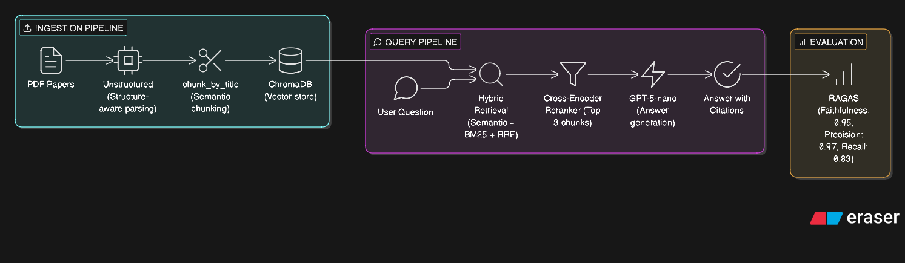

# Production-Level RAG System

A production-grade Retrieval Augmented Generation (RAG) system built to 
answer questions from academic research papers with citations. Built from 
scratch to understand every component of how RAG works in production — 
not just following a tutorial, but making real engineering decisions, 
measuring outcomes, and iterating based on data.

Inspired by [Aishwarya Srinivasan's](https://www.youtube.com/@AishwaryaSrinivasan) 
portfolio project recommendations.

---

## Why RAG?

Giving an LLM your entire document corpus as context is expensive, slow, 
and surprisingly ineffective — research shows that LLM answer quality 
degrades as context length grows (the "lost in the middle" problem). RAG 
solves this by retrieving only the most relevant chunks before generation, 
keeping context focused and costs low.

---

## What I Built

A domain-specific "Ask My Docs" system built on 8 research papers by 
Professor Marcel Moran (SJSU, 2024–2026) covering urban planning, street 
design, and transportation policy. The system retrieves relevant passages 
and generates answers with citations pointing back to the exact source paper.

---

## Architecture



---

## Evaluation Results

I ran 6 rounds of evaluation across 10 questions (5 easy, 5 tough) 
measuring how each architectural upgrade improved performance.

| Round | Configuration | Score |
|-------|--------------|-------|
| R1 | Semantic search only | 6.5/10 |
| R2 | + BM25 hybrid retrieval | 8.2/10 |
| R3 | + Cross-encoder reranker (k=3) | 6.8/10 |
| R4 | + Cross-encoder reranker (k=10) | 7.9/10 |
| R5 | + Unstructured chunking (k=10) | 8.65/10 |
| R6 | + Unstructured chunking (k=3) | **8.8/10** |

Key insight: The biggest jump came not from retrieval algorithms but from 
fixing chunking. No amount of BM25 or re-ranking can retrieve a chunk that 
doesn't exist in the right form.

### RAGAS Automated Evaluation (Final System)

| Metric | Score |
|--------|-------|
| Faithfulness | 0.95 |
| Context Recall | 0.83 |
| Context Precision | 0.97 |

---

## Tech Stack

| Component | Tool |
|-----------|------|
| PDF Extraction | Unstructured |
| Chunking | unstructured chunk_by_title |
| Vector Store | ChromaDB |
| Embeddings | all-MiniLM-L6-v2 (sentence-transformers) |
| Keyword Search | BM25 (rank-bm25) |
| Re-ranking | cross-encoder/ms-marco-MiniLM-L-6-v2 |
| Generation | GPT-5-nano (OpenAI) |
| Evaluation | RAGAS |
| Prompt Management | Custom YAML versioning |

---

## Project Structure

rag-professor/
├── data/                    # Research paper PDFs
├── src/
│   ├── extractor.py         # PDF extraction with Unstructured
│   ├── chunker.py           # Semantic chunking
│   ├── embedder.py          # ChromaDB storage
│   ├── retriever.py         # Hybrid search + re-ranking
│   ├── generator.py         # LLM answer generation
│   └── prompt_manager.py    # Prompt versioning
├── tests/
│   ├── eval_questions.py    # 10 annotated evaluation questions
│   ├── run_eval.py          # Manual evaluation runner
│   ├── ragas_eval.py        # RAGAS automated evaluation
│   └── smoke_test.py        # Lightweight CI test
├── .github/workflows/
│   └── eval.yml             # GitHub Actions CI pipeline
├── prompts.yaml             # Versioned prompt templates
├── DECISIONS.md             # Architecture decisions log
├── EVALUATION.md            # Phase 1 baseline evaluation
└── main.py                  # Ingestion pipeline

---

## Setup
```bash
# Clone the repo
git clone https://github.com/gowripreetham/Production_Level_RAG_System.git
cd Production_Level_RAG_System

# Create virtual environment
python -m venv venv
source venv/bin/activate

# Install dependencies
pip install -r requirements.txt

# Add your API key
echo "OPENAI_API_KEY=your_key_here" > .env

# Add your PDFs to data/ folder
# Then ingest them
python main.py

# Ask a question
python query.py
```

---

## CI Pipeline

GitHub Actions runs a smoke test on every push to main — verifying that 
all components initialize correctly and the retrieval pipeline returns 
results. Full RAGAS evaluation is run manually due to the document corpus 
not being committed to the repository (PDFs are excluded from version 
control for storage reasons).

---

## Key Learnings

- **Chunking quality matters more than retrieval algorithm** — switching 
  to Unstructured's structure-aware parser solved failures that BM25 and 
  re-ranking couldn't fix
- **Hybrid retrieval is essential for technical content** — BM25 finds 
  exact numbers and domain terms that semantic search misses
- **Measure everything** — running 6 rounds of evaluation with specific 
  questions revealed exactly where failures were happening and why
- **Prompt versioning is not optional** — treating prompts as versioned 
  config rather than hardcoded strings enables systematic experimentation

